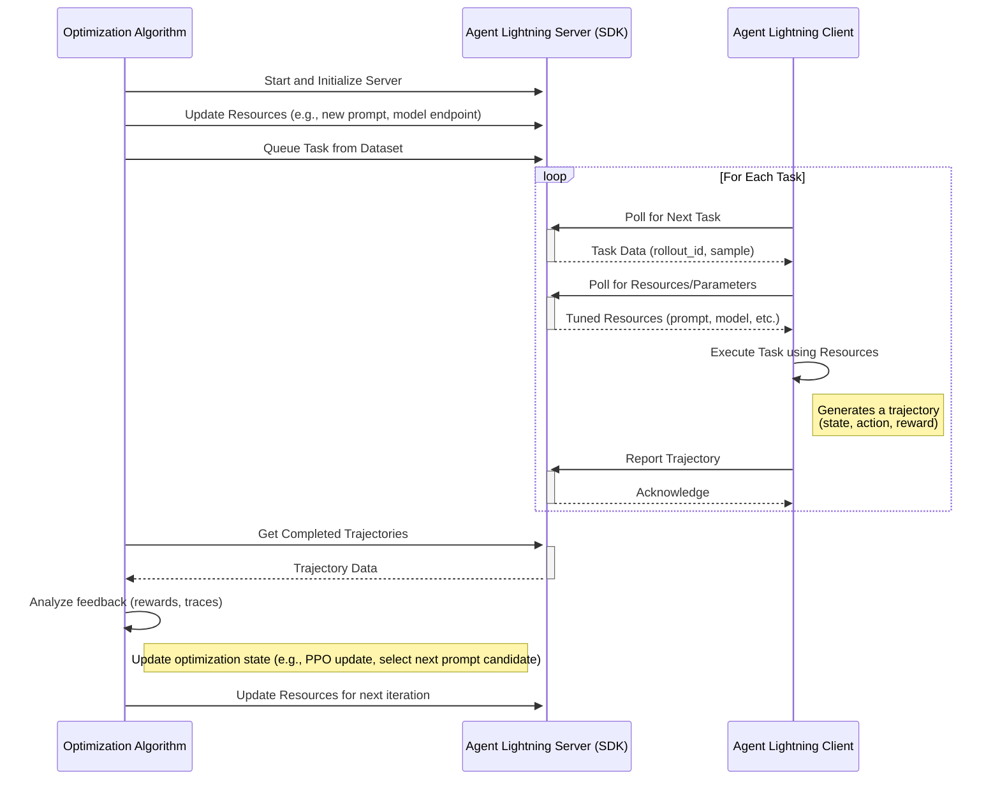

# Agent Lightning

## Idea and Components

The core idea is a server-client architecture for distributed, automated tuning of agent resources. The server, managed by an optimization algorithm, holds and tunes resources like large language models (LLMs), prompt templates, or complex workflow configurations. Client agents, operating in real or simulated environments, request these resources to perform tasks. They send back detailed execution traces, which the server's algorithm uses as feedback to refine the resources, creating a closed-loop optimization system.

## Key Components

- Agent Lightning Server: A central service that manages the communication protocol. It serves resources and task data to clients and collects resulting trajectories (traces). It acts as the bridge between the optimization algorithm and the agent clients. The server comes with a SDK, which provides functions to update tunable resources, queue tasks from a dataset, and retrieve completed trajectories submitted by clients.
- Optimization Algorithm: The developer-defined logic that drives the tuning process. This could be anything from a Reinforcement Learning (RL) algorithm (like PPO for model fine-tuning) to a heuristic-based search (like evolutionary algorithms for prompt optimization). It runs on the server-side and uses the Server SDK.
- Agent Lightning Client (and SDK): A lightweight agent that runs remotely. It uses the Client SDK to poll the server for new tasks and the latest versions of tuned resources. After executing a task, it reports the trajectory (state, action, reward) or traces back to the server.
- Tunable Resources: These are the components the algorithm is optimizing. This is a flexible concept that can include:
    - Model Weights: The actual parameters of an LLM.
    - Prompt Templates: The instructional text given to the agent.
    - Sampling Parameters: Hyperparameters like temperature, top-p, etc.
    - Workflow Graphs: The structure of a multi-step agent task.

## System Architecture Diagrams



## Pseudo Code

### Resource

```python
class LLM(Resource):
    endpoint: str
    model: str
    sampling_params: dict

class PromptTemplate(Resource):
    template: str
    engine: str
```

### Algorithm

```python
# 1. Initialize the server
server = AgentLightningServer()
server.start()

prompt_to_optimize = "What is the capital of {country}?"

for iteration in range(max_iterations):
    # 2. Update resources
    server.update_resources(
        prompt_template=PromptTemplate(template=prompt_to_optimize, engine="f-string"),
    )
    # 3. Queue tasks
    rollout_ids = [server.queue_task(data) for data in dataset]
    # 4. Poll for completed rollouts
    completed_rollouts = server.get_completed_rollouts(rollout_ids)
    # 5. Analyze rollouts and update optimization state
    metric = analyze_rollouts(completed_rollouts)
    prompt_to_optimize = optimize_prompt(prompt_to_optimize, metric)
```

### Client

```python
# 1. Initialize the client
client = AgentLightningClient(server_url="http://localhost:8000")

# 2. Poll for tasks
for rollout_id, task_data in client.poll_for_tasks():
    # 3. Get the latest resources
    resources = client.get_resources()
    # 4. Execute the task using the resources
    trajectory = execute_task(task_data, resources)
    # 5. Report the trajectory back to the server
    client.report_trajectory(rollout_id, trajectory)
```

## Design Choices

### Hosting the server as a persistent, long-running process

The optimization algorithm in the original proposal was responsible for running the server. In this design, it would instead become a client of this platform. This divides the server side into two distinct components:
- The Platform Server: A centralized, always-on service.
- The Algorithm Client: The user's optimization script, which connects to the platform to manage experiments.

#### Pros

- **Decoupling and Simplified Deployment:** The user developing the optimization algorithm no longer needs to manage the lifecycle of a web server. They can write a simple script that connects to the existing platform. They don't have to worry about ports, hosting, or process management.
- **Centralized Management and Scalability:** A dedicated platform can manage the core server's uptime, security, and scaling. It can also intelligently orchestrate and distribute jobs from multiple different algorithms and users, leading to better resource utilization.
- **Enhanced Observability:** With all experiments running through a central hub, the platform can provide dashboards, leaderboards, and detailed logging for all ongoing and past experiments in one place, which is invaluable for tracking and comparison.

#### Cons

- **Communication Overhead and Latency:** Every command from the algorithm (e.g., update_resources, queue_task) now involves a network round-trip to the platform server instead of a local function call.
- **Reduced Flexibility:** The platform's API becomes a rigid contract. In the original model, a user could modify the server's behavior directly to suit a novel experiment. In a platform model, they are constrained by the features the platform API exposes. Implementing a non-standard communication pattern would require a feature request and a platform update.
- **More Complex Debugging:** When something goes wrong, it can be harder to diagnose the issue. The problem could lie with the algorithm script, the network connection, the platform server, or the agent client. In the original design, the algorithm and server run in the same process, which is often easier to debug with standard tools.

### Comparison with traditional AutoML paradigm

thoughts:

AutoML: computation-light algorithms with computation-heavy model trainings. algorithms can be on a laptop, which launches jobs to the server.
Agent lightning: computation-light agents. LLM computations are mainly done and served by the server (sometimes by third-party  APIs, even within the algorithm in RL cases).
computation-heavy means that a heavy model needs to be trained or inferences, normally on a GPU server. Though some agents are also heavy, but the main burden are in the environment they depend on, or the time consumption. It does not make sense for the agent side to run a stateful server.
Initate connection from client to server is possible. Initiate connection from server to client requires hack in most cases.

parallel level: each trial in automl trains and evaluates on a dataset (at least a subset of it). The algorithm is not usually not aware of the dataset. In agent lightning, each trial is a single task, which is usually a single sample from a dataset. The algorithm is aware of the dataset, and can queue tasks from it.
This originates from the idea that agents perform "single rollouts" rather than "model trainings and evaluations". The algorithm alleviates the burden of managing and iterating over the dataset to the server side to support better algorithm support (e.g., RL algorithms) and better parallelism.

metric data: Agent reports intermediate and final rewards for one rollout, whereas AutoML trials directly report the final metric (e.g., F1 score). Agent algorithms are responsible for aggregating the rewards into monitorable metrics.

commons: Stateful algorithm and stateless *trials*

[DO NOT USE TABLES FOR THE COMPARISON!]


### fetch resource data with or without task data

multiple task data could be fetched as a batch -- The isolation is better.
if resource is always fetched alongside the task data, combining them will simplify the code.


### Reporting full trace data vs. prompt-response-reward triplets

I think we have several options for this design:

1. Full trace collected: the hierarchical opentelemetry trace. 
2. Logs: in the full-trace setting, we even collect the stdout or other logging information. fully customizable by agents, some optimizers (especially LLM-based ones) might work better.
3. Triplets: friendly for RL algorithms. agents will be responsible for selecting the triplets from the full trace if they want to optimize only a subset of the trace in a Multi-agent setting.

Assumptions (is it true?):
- Agent must have at least one LLM call, giving them at least one prompt-response pair.
- the reward does not have to be rewarding the prompt-responses. They can be a criteria for whether current workflow configuration is good or not.
