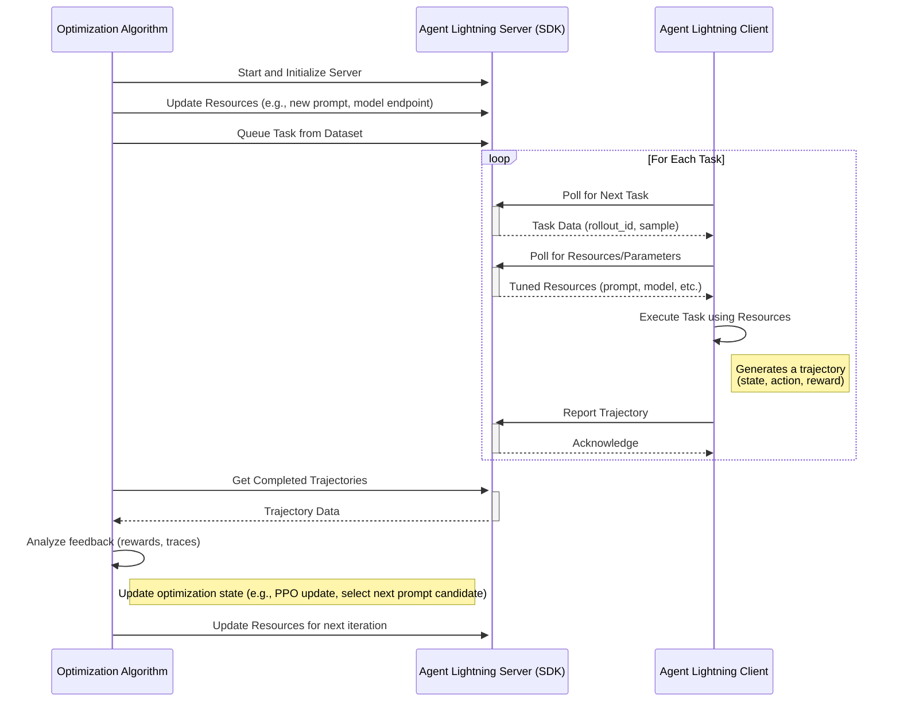

# Agent Lightning

## Idea and Components

The core idea is a server-client architecture for distributed, automated tuning of agent resources. The server, managed by an optimization algorithm, holds and tunes resources like large language models (LLMs), prompt templates, or complex workflow configurations. Client agents, operating in real or simulated environments, request these resources to perform tasks. They send back detailed execution traces, which the server's algorithm uses as feedback to refine the resources, creating a closed-loop optimization system.

## Key Components

- Agent Lightning Server: A central service that manages the communication protocol. It serves resources and task data to clients and collects resulting trajectories (traces). It acts as the bridge between the optimization algorithm and the agent clients. The server comes with a SDK, which provides functions to update tunable resources, queue tasks from a dataset, and retrieve completed trajectories submitted by clients.
- Optimization Algorithm: The developer-defined logic that drives the tuning process. This could be anything from a Reinforcement Learning (RL) algorithm (like PPO for model fine-tuning) to a heuristic-based search (like evolutionary algorithms for prompt optimization). It runs on the server-side and uses the Server SDK.
- Agent Lightning Client (and SDK): A lightweight agent that runs remotely. It uses the Client SDK to poll the server for new tasks and the latest versions of tuned resources. After executing a task, it reports the trajectory (state, action, reward) or traces back to the server.
- Tunable Resources: These are the components the algorithm is optimizing. This is a flexible concept that can include:
  - Model Weights: The actual parameters of an LLM.
  - Prompt Templates: The instructional text given to the agent.
  - Sampling Parameters: Hyperparameters like temperature, top-p, etc.
  - Workflow Graphs: The structure of a multi-step agent task.

## System Architecture Diagrams



## Pseudo Code

### Resource

```python
class LLM(Resource):
    endpoint: str
    model: str
    sampling_params: dict

class PromptTemplate(Resource):
    template: str
    engine: str
```

### Algorithm

```python
# 1. Initialize the server
server = AgentLightningServer()
server.start()

prompt_to_optimize = "What is the capital of {country}?"

for iteration in range(max_iterations):
    # 2. Update resources
    server.update_resources(
        prompt_template=PromptTemplate(template=prompt_to_optimize, engine="f-string"),
    )
    # 3. Queue tasks
    rollout_ids = [server.queue_task(data) for data in dataset]
    # 4. Poll for completed rollouts
    completed_rollouts = server.get_completed_rollouts(rollout_ids)
    # 5. Analyze rollouts and update optimization state
    metric = analyze_rollouts(completed_rollouts)
    prompt_to_optimize = optimize_prompt(prompt_to_optimize, metric)
```

### Client

```python
# 1. Initialize the client
client = AgentLightningClient(server_url="http://localhost:8000")

# 2. Poll for tasks
for rollout_id, task_data in client.poll_for_tasks():
    # 3. Get the latest resources
    resources = client.get_resources()
    # 4. Execute the task using the resources
    trajectory = execute_task(task_data, resources)
    # 5. Report the trajectory back to the server
    client.report_trajectory(rollout_id, trajectory)
```

## Design Options

### Hosting Architecture as a Platform-Centric Model

An alternative approach is that the system will be architected around a **persistent, long-running platform server**. The optimization algorithm will act as a client to this platform. This choice prioritizes long-term scalability and decouples the optimization logic from the infrastructure, allowing developers to focus on their algorithm without managing a web server's lifecycle. A central platform provides superior observability, multi-tenancy, and resource management.

However, a simpler, script-managed server is viable for initial prototyping, and refactoring to a client-server model will be relatively straightforward. The key is to ensure the server's API is well-defined and modular, allowing for easy transition to a platform-centric architecture later.

### A Comparison to AutoML

While both are optimization frameworks, Agent Lightning operates on a different paradigm than traditional AutoML.

- **Optimization Goal**: AutoML's primary goal is **model creation**. It tunes hyperparameters to produce the best possible static model from a training process. Agent Lightning's goal is **behavioral optimization**. It tunes the runtime resources of an agent to improve its performance and decision-making during a live or simulated interaction.
- **Computational Load**: In AutoML, algorithm is light, launches heavy model training jobs. In Agent Lighting, agent client is light, server manages and serves resources.
- **Unit of Work ("Trial")**: In AutoML, a trial is a complete **train-and-evaluate cycle** on a dataset, resulting in a single model with a final performance score. In Agent Lightning, a trial is a single **task rollout** or "episode," where an agent performs a task in an environment.
- **Feedback Mechanism**: AutoML receives a **terminal, scalar metric** as feedback (e.g., `Accuracy = 92%`). This indicates the overall quality of the final model but not _why_ it performs that way. Agent Lightning receives a **rich, sequential trace** of the entire rollout. This detailed feedback allows the algorithm to understand and optimize the intermediate steps, decisions, and tool use within the agent's workflow.
- **Data Awareness**: AutoML algorithms are typically **dataset-agnostic**; they receive a pointer to data but don't interact with individual samples. The Agent Lightning algorithm is **dataset-aware**, actively queuing specific tasks from a dataset. This enables advanced strategies like curriculum learning or focusing on tasks where the agent currently struggles.

### Decoupled Resource and Task Fetching

Resource fetching and task fetching will be handled by **separate API endpoints**. The design significantly improves network efficiency. Resources (like a prompt) often change far less frequently than tasks. Separating the endpoints allows the client to **cache resources** locally and only poll for new tasks. This also simplifies task batching and makes resource versioning more explicit.

The bundled alternative, fetching resources along with the task data, simplifies the client-side logic to a single API call per job. This shortens one line of code, which is not worth the trade-offs in flexibility and efficiency.

### Reporting Formats

Forcing a single, rigid data format is too limiting, while allowing completely unstructured data creates chaos for the optimization algorithm. The choice between reporting formats boils down to a classic trade-off between structured simplicity and rich, complex context.

- **Prompt-Response-Reward Triplets** are like a **store receipt**. They are structured, easy to read, and contain the most critical information for a specific purpose (e.g., RL training). You can quickly see the items purchased (prompt/response) and the total cost (reward). They are highly efficient for algorithms that just need that core data.
- **A Full OpenTelemetry Trace** is like the store's **full security camera footage**. It shows not just _what_ was bought, but the customer's entire journey: how they navigated the aisles, what they looked at but didn't buy, and where they hesitated. This data is invaluable for deep analysis and debugging _why_ a particular outcome occurred, but it's much heavier and more complex to process.

This proposed design should hold up well against the following assumptions:

- **"Agent might have zero to mulitple LLM calls."** An agent could be a workflow of traditional tools. It could simply perform its task and return a `Trajectory` with a `final_reward` and maybe some custom `metrics` like latency or cost, without any LLM calls or triplets. This makes Agent Lightning a more general-purpose optimization framework.
- **"The reward does not have to be rewarding the prompt-responses."** The `final_reward` is decoupled from the `triplets`. You can have a task-level reward, step-level rewards within each `Triplet`, or both. This is crucial for complex tasks where credit assignment is difficult.
- **"Some agents might not be easily traced and want to report their own triplets."** When tracing does not work, the developer can simply construct the log object manually with whatever logic makes sense for their specific case.

Instead of allowing the client to return arbitrary data types (`float`, `list`), the SDK should enforce the return of a single, standardized data object. Let's call it a `Rollout`. This object would have well-defined fields, some of which are optional.

```python
@dataclass
class Triplet:
    """A standard structure for a single turn in a trajectory."""
    prompt: Any
    response: Any
    reward: Optional[float] = None
    metadata: Dict[str, Any] = field(default_factory=dict)

@dataclass
class Rollout:
    """The standard reporting object from client to server."""
    rollout_id: str

    # Primary, high-level feedback
    final_reward: Optional[float] = None

    # Structured, sequential feedback for RL-style optimization
    triplets: Optional[List[Triplet]] = None

    # Optional, rich-context data for deep analysis
    trace_data: Optional[Dict[str, Any]] = None # For serialized OpenTelemetry data
    logs: Optional[List[str]] = None

    # A bucket for any other relevant numbers
    metrics: Dict[str, float] = field(default_factory=dict)
```

A client can support various optimization schemes by choosing what to populate. It may only need to report the final outcome. `client.report(Rollout(rollout_id=id, final_reward=0.95))`. Or, a client having issues can include the full trace for inspection by the developer or an LLM-based analyzer: `client.report(Rollout(rollout_id=id, final_reward=0.2, trace_data={...}, logs=[...]))`. That being sai, I think triplets should be sufficient for 90% of the cases.

We support an `automatic_trace` flag in client SDK. When enabled, a client-side SDK wrapper could automatically instrument LLM calls, populate the `triplets` and `trace_data` fields, and return the complete `Rollout` object. This provides "convention over configuration" -- users get rich data for free, but they can override it or construct it manually for full control.
