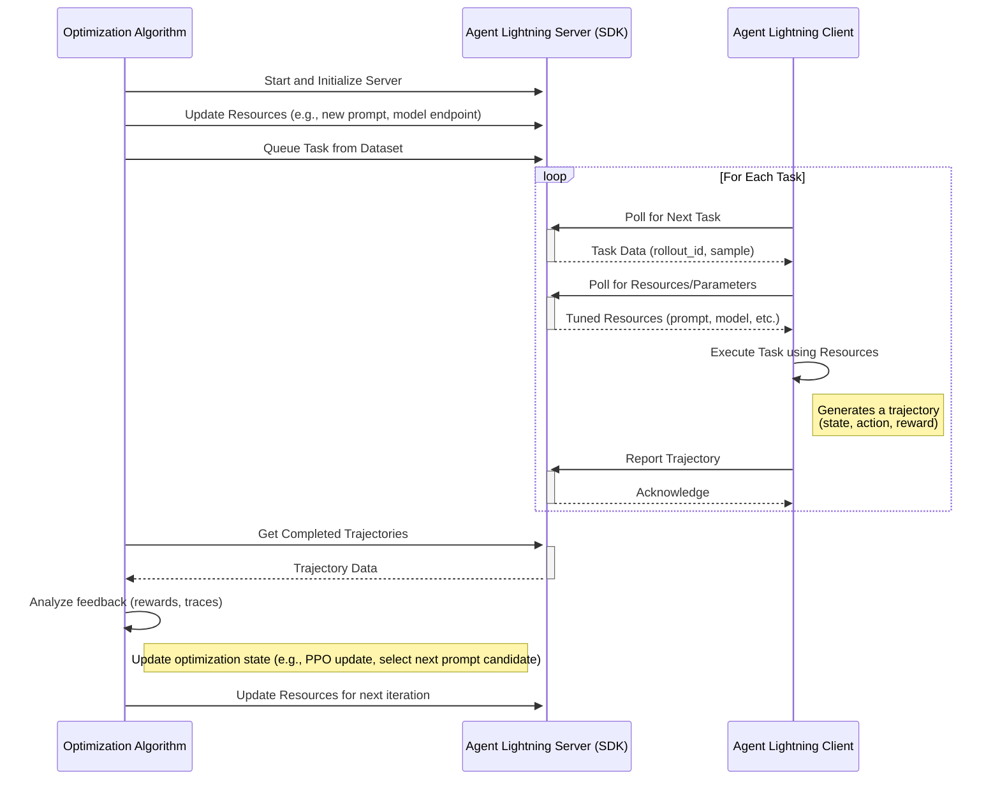

# Agent Lightning

## Idea and Components

The core idea is a server-client architecture for distributed, automated tuning of agent resources. The server, managed by an optimization algorithm, holds and tunes resources like large language models (LLMs), prompt templates, or complex workflow configurations. Client agents, operating in real or simulated environments, request these resources to perform tasks. They send back detailed execution traces, which the server's algorithm uses as feedback to refine the resources, creating a closed-loop optimization system.

## Key Components

- Agent Lightning Server: A central service that manages the communication protocol. It serves resources and task data to clients and collects resulting trajectories (traces). It acts as the bridge between the optimization algorithm and the agent clients. The server comes with a SDK, which provides functions to update tunable resources, queue tasks from a dataset, and retrieve completed trajectories submitted by clients.
- Optimization Algorithm: The developer-defined logic that drives the tuning process. This could be anything from a Reinforcement Learning (RL) algorithm (like PPO for model fine-tuning) to a heuristic-based search (like evolutionary algorithms for prompt optimization). It runs on the server-side and uses the Server SDK.
- Agent Lightning Client (and SDK): A lightweight agent that runs remotely. It uses the Client SDK to poll the server for new tasks and the latest versions of tuned resources. After executing a task, it reports the trajectory (state, action, reward) or traces back to the server.
- Tunable Resources: These are the components the algorithm is optimizing. This is a flexible concept that can include:
    - Model Weights: The actual parameters of an LLM.
    - Prompt Templates: The instructional text given to the agent.
    - Sampling Parameters: Hyperparameters like temperature, top-p, etc.
    - Workflow Graphs: The structure of a multi-step agent task.

## System Architecture Diagrams

## Alternatives

### Hosting the server as a persistent, long-running process

This platform-like diffs in that the optimization algorithm in the original proposal was responsible for running the server, would instead become a client of this platform. This divides the server side into two distinct components:

- The Platform Server: A centralized, always-on service.
- The Algorithm Client: The user's optimization script, which connects to the platform to manage experiments.

#### Pros

- Decoupling and Simplified Deployment: The user developing the optimization algorithm no longer needs to manage the lifecycle of a web server. They can write a simple script that connects to the existing platform. They don't have to worry about ports, hosting, or process management.
- Centralized Management and Scalability: A dedicated platform can manage the core server's uptime, security, and scaling. It can also intelligently orchestrate and distribute jobs from multiple different algorithms and users, leading to better resource utilization.
- Enhanced Observability: With all experiments running through a central hub, the platform can provide dashboards, leaderboards, and detailed logging for all ongoing and past experiments in one place, which is invaluable for tracking and comparison.

#### Cons

- Communication Overhead and Latency: Every command from the algorithm (e.g., update_resources, queue_task) now involves a network round-trip to the platform server instead of a local function call.
- Reduced Flexibility: The platform's API becomes a rigid contract. In the original model, a user could modify the server's behavior directly to suit a novel experiment. In a platform model, they are constrained by the features the platform API exposes. Implementing a non-standard communication pattern would require a feature request and a platform update.
- More Complex Debugging: When something goes wrong, it can be harder to diagnose the issue. The problem could lie with the algorithm script, the network connection, the platform server, or the agent client. In the original design, the algorithm and server run in the same process, which is often easier to debug with standard tools.
