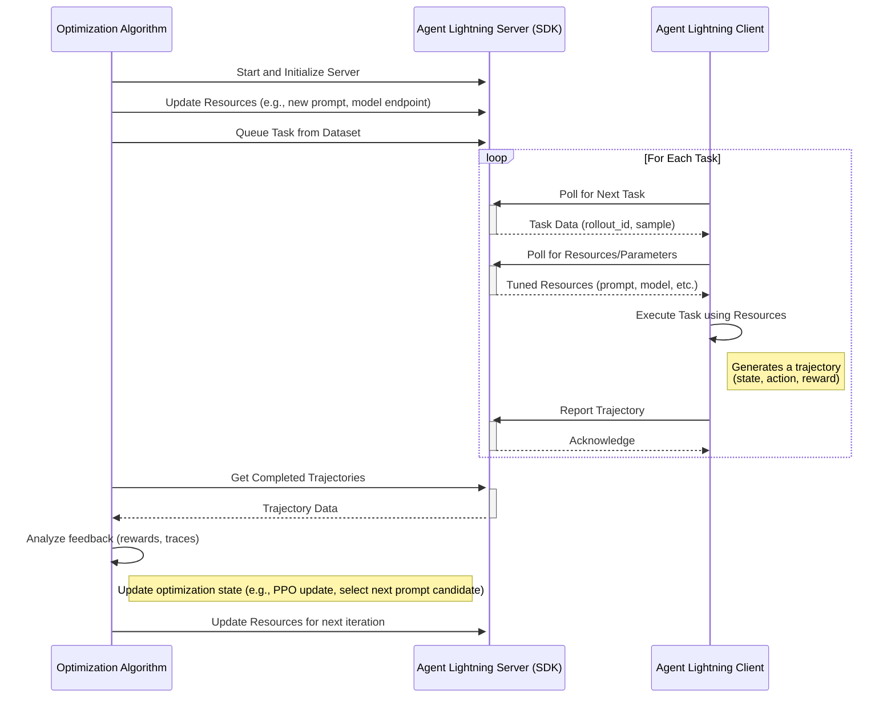

# Agent Lightning

## Idea and Components

The core idea is a server-client architecture for distributed, automated tuning of agent resources. The server, managed by an optimization algorithm, holds and tunes resources like large language models (LLMs), prompt templates, or complex workflow configurations. Client agents, operating in real or simulated environments, request these resources to perform tasks. They send back detailed execution traces, which the server's algorithm uses as feedback to refine the resources, creating a closed-loop optimization system.

## Key Components

- Agent Lightning Server: A central service that manages the communication protocol. It serves resources and task data to clients and collects resulting trajectories (traces). It acts as the bridge between the optimization algorithm and the agent clients. The server comes with a SDK, which provides functions to update tunable resources, queue tasks from a dataset, and retrieve completed trajectories submitted by clients.
- Optimization Algorithm: The developer-defined logic that drives the tuning process. This could be anything from a Reinforcement Learning (RL) algorithm (like PPO for model fine-tuning) to a heuristic-based search (like evolutionary algorithms for prompt optimization). It runs on the server-side and uses the Server SDK.
- Agent Lightning Client (and SDK): A lightweight agent that runs remotely. It uses the Client SDK to poll the server for new tasks and the latest versions of tuned resources. After executing a task, it reports the trajectory (state, action, reward) or traces back to the server.
- Tunable Resources: These are the components the algorithm is optimizing. This is a flexible concept that can include:
    - Model Weights: The actual parameters of an LLM.
    - Prompt Templates: The instructional text given to the agent.
    - Sampling Parameters: Hyperparameters like temperature, top-p, etc.
    - Workflow Graphs: The structure of a multi-step agent task.

## System Architecture Diagrams



## Pseudo Code

### Resource

```python
class LLM(Resource):
    endpoint: str
    model: str
    sampling_params: dict

class PromptTemplate(Resource):
    template: str
    engine: str
```

### Algorithm

```python
# 1. Initialize the server
server = AgentLightningServer()
server.start()

prompt_to_optimize = "What is the capital of {country}?"

for iteration in range(max_iterations):
    # 2. Update resources
    server.update_resources(
        prompt_template=PromptTemplate(template=prompt_to_optimize, engine="f-string"),
    )
    # 3. Queue tasks
    rollout_ids = [server.queue_task(data) for data in dataset]
    # 4. Poll for completed rollouts
    completed_rollouts = server.get_completed_rollouts(rollout_ids)
    # 5. Analyze rollouts and update optimization state
    metric = analyze_rollouts(completed_rollouts)
    prompt_to_optimize = optimize_prompt(prompt_to_optimize, metric)
```

### Client

```python
# 1. Initialize the client
client = AgentLightningClient(server_url="http://localhost:8000")

# 2. Poll for tasks
for rollout_id, task_data in client.poll_for_tasks():
    # 3. Get the latest resources
    resources = client.get_resources()
    # 4. Execute the task using the resources
    trajectory = execute_task(task_data, resources)
    # 5. Report the trajectory back to the server
    client.report_trajectory(rollout_id, trajectory)
```

## Design Options

### Hosting Architecture as a Platform-Centric Model

An alternative approach is that the system will be architected around a **persistent, long-running platform server**. The optimization algorithm will act as a client to this platform. This choice prioritizes long-term scalability and decouples the optimization logic from the infrastructure, allowing developers to focus on their algorithm without managing a web server's lifecycle. A central platform provides superior observability, multi-tenancy, and resource management.

However, a simpler, script-managed server is viable for initial prototyping, and refactoring to a client-server model will be relatively straightforward. The key is to ensure the server's API is well-defined and modular, allowing for easy transition to a platform-centric architecture later.

### A Comparison to AutoML

While both are optimization frameworks, Agent Lightning operates on a different paradigm than traditional AutoML.

- **Optimization Goal**: AutoML's primary goal is **model creation**. It tunes hyperparameters to produce the best possible static model from a training process. Agent Lightning's goal is **behavioral optimization**. It tunes the runtime resources of an agent to improve its performance and decision-making during a live or simulated interaction.
- **Computational Load**: In AutoML, algorithm is light, launches heavy model training jobs. In Agent Lighting, agent client is light, server manages and serves resources.
- **Unit of Work ("Trial")**: In AutoML, a trial is a complete **train-and-evaluate cycle** on a dataset, resulting in a single model with a final performance score. In Agent Lightning, a trial is a single **task rollout** or "episode," where an agent performs a task in an environment.
- **Feedback Mechanism**: AutoML receives a **terminal, scalar metric** as feedback (e.g., `Accuracy = 92%`). This indicates the overall quality of the final model but not *why* it performs that way. Agent Lightning receives a **rich, sequential trace** of the entire rollout. This detailed feedback allows the algorithm to understand and optimize the intermediate steps, decisions, and tool use within the agent's workflow.
- **Data Awareness**: AutoML algorithms are typically **dataset-agnostic**; they receive a pointer to data but don't interact with individual samples. The Agent Lightning algorithm is **dataset-aware**, actively queuing specific tasks from a dataset. This enables advanced strategies like curriculum learning or focusing on tasks where the agent currently struggles.

### Decoupled Resource and Task Fetching

Resource fetching and task fetching will be handled by **separate API endpoints**. The design significantly improves network efficiency. Resources (like a prompt) often change far less frequently than tasks. Separating the endpoints allows the client to **cache resources** locally and only poll for new tasks. This also simplifies task batching and makes resource versioning more explicit.

The bundled alternative, fetching resources along with the task data, simplifies the client-side logic to a single API call per job. This shortens one line of code, which is not worth the trade-offs in flexibility and efficiency.

### Reporting full trace data vs. prompt-response-reward triplets

I think we have several options for this design:

1. Full trace collected: the hierarchical opentelemetry trace. 
2. Logs: in the full-trace setting, we even collect the stdout or other logging information. fully customizable by agents, some optimizers (especially LLM-based ones) might work better.
3. Triplets: friendly for RL algorithms. agents will be responsible for selecting the triplets from the full trace if they want to optimize only a subset of the trace in a Multi-agent setting. Better debugability -- client can directly see the triplets they are reporting. Better alignment with the naming (rollout, which is a RL term).

Assumptions (is it true?):
- Agent must have at least one LLM call, giving them at least one prompt-response pair.
- the reward does not have to be rewarding the prompt-responses. They can be a criteria for whether current workflow configuration is good or not.
- some agents might not be easily traced. They want to report their own triplets for optimization.

Proposal: Similar to pytorch lightning, I can have an `automatic_trace` (similar to `automatic_optimization` in pytorch lightning), which is responsible for tracing the agent, LLM calls automatically. I can have multiple allowed return type for `training_rollout` method.

1. a float (final reward)
2. a list of triplets (prompt, response, reward)
3. a full trace (opentelemetry trace)
4. ...

Communicating between the client and server: I think triplets should be required and sufficient for 90% cases. The full trace can be optional, and the client can report it if they want to. The server can also request the full trace if needed for debugging or analysis. In case the triplets are not available, the trace can be required.
